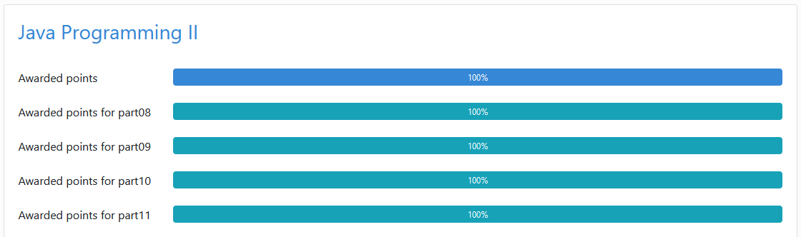

## Work experience

The section describes my work experience related to software documentation development.

### Evotor

February 2017 — till now

Technical writer

* Develop reference and non-reference Cloud API documentation based on OpenAPI Specification 3.0.
* Develop reference and non-reference documentation for the company's Android SDKs.
* Maintain documentation site.
* Communicate with product teams and managers to gather information.
* Write and proofread UI texts.

### Kaspersky Lab

January 2014 — February 2017 3 years 2 months

Technical writer

* Developed various documentation from scratch for B2B and B2C products of the company. Including administrator guides, user guides, release notes.
* Maintained existed documentation.
* Applied single source and content reuse strategies within a documentation development process.
* Communicated with product development teams and managers to gather information.
* Wrote and proofread GUI texts according to the company's style guide

## Education

Moscow Technological University (MIREA)

2011 Specialist, Microelectronics and Solid-State Electronics

## Key skills

Languages:

* Russian — Native;
* English — C1 — Advanced.

Technologies:

* Languages: Markdown, YAML, OpenAPI Specification, HTML, CSS, Liquid, Java, JavaScript;
* Version control: Git, GitHub;
* Static site generator: Jekyll;
* docs-like-code approach.

## Current educational endeavors

### Java

At the beginning of this year, I enrolled in the [University of Helsinki's free massive open online course (MOOC) on programming](https://java-programming.mooc.fi/). Unfortunately, the course translation is on hiatus since the end of April, so I'm unable to get certification yet.

Nonetheless, I've completed all available exercises up to part 12.

### JavaScript, HTML and CSS

The section shows some projects that I've done on [the Odin Project web development course](https://www.theodinproject.com).

* [Rock Paper Scissors](https://lytkini.com/JS-rock-paper-scissors-TheOdinProject/)
* [Etch-A-Sketch](https://lytkini.com/etch-a-sketch-TheOdinProject/)
* Calculator (in progress)